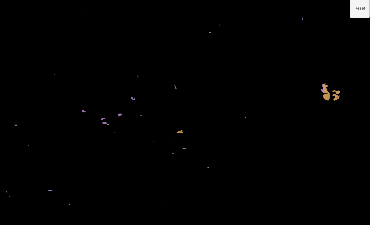
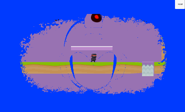

# Unity Transition Effect Shader
A shader to create cool transition effects in unity.

I wrote this shader to mimic what [Dan](http://danjohnmoran.com) did in his [youtube video](https://www.youtube.com/watch?v=LnAoD7hgDxw).

The shader was rewritten to add a way to use textures as a transition image instead of just a color while preserving the ability to use any transition color.

# Demo
You can make cool things like
 using 

or if you used a noisier texture, you can create


but why stop there ? you can use images like this the ones from [this pack](http://blo0p.deviantart.com/art/Bloop-s-New-Superhero-Wallpapers-304284941) and end up with something like

(Color is modifiable too)

and lastly you can use another texture (or the same one) for the transition image to create something like


# Using the shader
The shader is used by creating a material out of it [Right click on the shader in Unity and then create a new material] and using that material in a C# `MonoBehaviour`.

The C# script should have a `Graphics.Blit` inside the `OnRenderImage()`
```c#
public Material mat;

void OnRenderImage (RenderTexture source, RenderTexture destination){
	Graphics.Blit(source,destination,mat);
}
```
Attach the script to the camera and go into play mode.
You can get the effect by adjusting the slider in the material.

To access the the slider from code you can call:
```c#
mat.SetFloat("_Cutoff",newValue);
```
before `Graphics.Blit`

#Author
Jafar Abdulrasoul [@JimmarxD](https://twitter.com/jimmarxd)